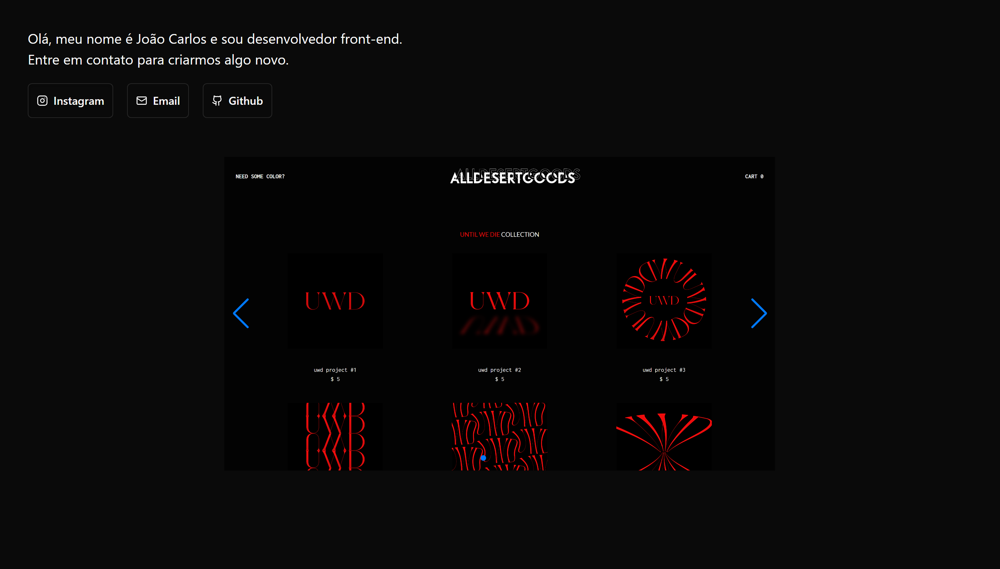

<h1 align="center"> 🌎 Npx World </h1>

  <a href="#-tecnologias">Tecnologias</a>&nbsp;&nbsp;&nbsp;|&nbsp;&nbsp;&nbsp;
  <a href="#-projeto">Projeto</a>&nbsp;&nbsp;&nbsp;

 

  

## 🚀 Tecnologias

Esse projeto foi desenvolvido com as seguintes tecnologias:

- JavaScript
- [React](https://react.dev/)
- [TailwindCSS](https://tailwindcss.com/)
- [Shadcn/ui](https://ui.shadcn.com/)
- [SwiperJS](https://swiperjs.com/)
- [Vite](https://vitejs.dev/)

## 💻 Projeto

Portfolio para apresentação de projetos.
